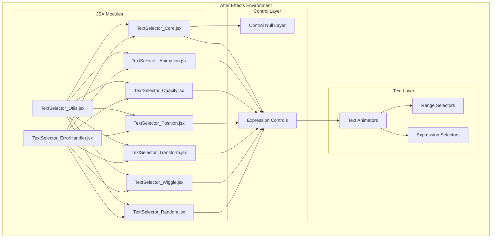

# Design Document

## Overview

The Text Selector Modular System v2.0 is architected as a collection of interconnected JSX modules that work together to provide comprehensive text animation capabilities in After Effects. The system replaces the monolithic Text_Selector.ffx preset with a modular approach that emphasizes maintainability, performance, and extensibility, specifically optimized for modern JavaScript Engine.

The core design philosophy centers around separation of concerns, where each module handles a specific aspect of text animation while communicating through a standardized Expression Controls interface. This enhanced version incorporates advanced error handling, performance optimizations, smooth wiggle capabilities, comprehensive debugging tools, and a robust testing framework. The system follows modern software engineering principles with proper error resilience, memory management, and multi-frame rendering compatibility.

## Architecture

### System Architecture Overview



### Module Hierarchy and Dependencies

The system follows a layered architecture with clear dependency relationships:

**Foundation Layer:**

- `TextSelector_Utils.jsx` - Core utilities and helper functions
- `TextSelector_ErrorHandler.jsx` - Error handling and debugging infrastructure

**Core Layer:**

- `TextSelector_Core.jsx` - System initialization and common interfaces

**Feature Modules:**

- `TextSelector_Animation.jsx` - Timing and sequencing control
- `TextSelector_Opacity.jsx` - Opacity management
- `TextSelector_Position.jsx` - Position and anchor point control
- `TextSelector_Transform.jsx` - Scale, rotation, and distortion effects
- `TextSelector_Wiggle.jsx` - Wiggle effect generation
- `TextSelector_Random.jsx` - Randomization systems

### Communication Protocol

Modules communicate through a standardized Expression Controls interface:

1. **Control Layer Creation**: Core module creates a null layer with organized effect controls
2. **Effect Naming Convention**: All effects use "TextSelector\_" prefix for namespace isolation
3. **Cross-Module References**: Modules reference other modules' controls using consistent naming
4. **Expression Binding**: Text animators bind to control layer effects through expressions

## Components and Interfaces

### Core System Component

**Purpose**: System initialization, common utilities, and module coordination

**Key Interfaces**:

```javascript
// Global constants and namespacing
var TEXTSELECTOR_NAMESPACE = "TextSelector_";
var TEXTSELECTOR_VERSION = "2.0.1";

// Effect creation interface
function createSliderControl(layer, name, value, min, max)
function createCheckboxControl(layer, name, value)
function createPointControl(layer, name, value)

// System initialization
function initializeTextSelectorCore()
```

**Control Properties**:

- System Info (version display)
- Global Enable (master on/off switch)
- Debug Mode (debugging toggle)

### Animation Controller Component

**Purpose**: Manages timing, sequencing, and animation style coordination

**Key Interfaces**:

```javascript
function createAnimationController(controlLayer)
function applyAnimationExpressions(textLayer, controlLayerName)
function generatePositionYExpression(controlLayerName)
function generatePositionXExpression(controlLayerName)
function generate2WayRandomizerExpression(controlLayerName)
```

**Control Properties**:

- Animation (0-100 slider for keyframe control)
- Delay (0-2 seconds timing offset)
- Ani-Style (1=Single, 2=2-way XY, 3=2-way YX)
- Posterize(0=FPS) (frame rate control)

**Expression Generation**:

- Optimized valueAtTime calculations with caching
- Conditional delay multipliers for 2-way modes
- Performance-optimized posterizeTime implementation

### Opacity Controller Component

**Purpose**: Manages text opacity with automatic and manual modes

**Key Interfaces**:

```javascript
function createOpacityController(controlLayer)
function applyOpacityExpressions(textLayer, controlLayerName)
function generateOpacityExpression(controlLayerName)
function generateOpacityDisplayExpression(controlLayerName)
```

**Control Properties**:

- Opacity-Style (1=Auto, 2=Manual)
- Opacity (Manual) (0-100 manual control)
- Opacity (0-100 display value)

**Opacity Modes**:

- **Auto Mode**: Frame-based fade-in calculation
- **Manual Mode**: Keyframeable opacity with character delay
- **Display Logic**: Conditional opacity value presentation

### Position Controller Component

**Purpose**: Controls character positioning and anchor point management

**Key Interfaces**:

```javascript
function createPositionController(controlLayer)
function applyPositionExpressions(textLayer, controlLayerName)
```

**Control Properties**:

- Ani-Position (XY point control for manual positioning)
- Text AnkerPoint (anchor point adjustment, default [0, -40])

**Position Modes**:

- **Single Mode**: Uses manual Ani-Position values
- **2-way Modes**: Generates random positions within composition bounds
- **Anchor Control**: Additive anchor point adjustment

### Transform Controller Component

**Purpose**: Manages scale, rotation, and distortion transformations

**Key Interfaces**:

```javascript
function createTransformController(controlLayer)
function applyTransformExpressions(textLayer, controlLayerName)
```

**Control Properties**:

- Add Scale (XY point control, additive to 100%)
- Scale ON (boolean toggle)
- Add Rotation (degree slider)
- Rotation ON (boolean toggle)
- Add Distortion (distortion amount slider)
- Add Dis-Axis (distortion axis slider)
- Distortion ON (boolean toggle)

**Transform Logic**:

- **Manual Mode**: Applies additive transform values
- **2-way Random Mode**: Generates random values within specified ranges
- **Conditional Application**: Respects individual ON/OFF toggles

### Wiggle Controller Component

**Purpose**: Generates organic motion through wiggle effects with advanced smooth motion capabilities

**Key Interfaces**:

```javascript
function createWiggleController(controlLayer)
function generateWigglePositionExpression(controlLayerName)
function generateWiggleScaleExpression(controlLayerName)
function generateWiggleRotationExpression(controlLayerName)
function generateWiggleDistortionExpression(controlLayerName)
```

**Control Properties**:

- Wiggle Add (master wiggle enable)
- Fluc/Sec (XY frequency control with separate X/Y values)
- Wiggle Position (XY amplitude control)
- Wiggle Scale (XY amplitude control)
- Wiggle Rotation (rotation amplitude slider -360 to 360)
- Wiggle Distortion (distortion amplitude slider -100 to 100)
- Wiggle Seed (1-1000 randomization seed for consistency)
- Smooth Wiggle (sine wave vs. standard wiggle toggle)

**Advanced Wiggle Features**:

- **Character-Specific Timing**: Unique time offsets (textIndex _ frameDuration _ 0.1) per character
- **Smooth Mode**: Sine wave calculations using Math.sin() for smoother, more natural motion
- **Performance Optimization**: Early exit when disabled, posterizeTime integration
- **Seed Management**: Character-unique seeds (seed + textIndex + offset) for varied motion
- **Multi-Property Support**: Independent wiggle control for position, scale, rotation, and distortion
- **Frequency Separation**: Independent X and Y frequency control for complex motion patterns

**Smooth Wiggle Implementation**:

```javascript
// Smooth wiggle using sine waves for natural motion
if (smooth) {
  var x = Math.sin(currentTime * freq[0] * 2 * Math.PI) * amp[0];
  var y = Math.sin(currentTime * freq[1] * 2 * Math.PI + Math.PI / 3) * amp[1];
  [x, y];
} else {
  // Standard wiggle with character-specific timing
  [
    wiggle(freq[0], amp[0], 1, 0.5, currentTime)[0],
    wiggle(freq[1], amp[1], 1, 0.5, currentTime)[1],
  ];
}
```

### Randomization System Component

**Purpose**: Provides controlled randomization for various animation properties

**Key Interfaces**:

```javascript
function createRandomizationSystem(controlLayer)
function applyRandomExpressions(textLayer, controlLayerName)
```

**Control Properties**:

- SeedRandom (0-1000 master seed value)
- [2 way - Randomize] (informational group)

**Randomization Patterns**:

- **2-way Position**: Alternating positive/negative based on textIndex % 2
- **2-way Scale**: Conditional randomization when Scale ON and 2-way modes active
- **2-way Rotation**: Conditional randomization when Rotation ON and 2-way modes active
- **2-way Distortion**: Conditional randomization when Distortion ON and 2-way modes active

### Error Handler Component

**Purpose**: Provides robust error handling and debugging capabilities

**Key Interfaces**:

```javascript
function createErrorHandler()
function generateSafeExpression(expressionCode, fallbackValue)
function manageDebuggerPreference()
function restoreDebuggerPreference(originalState)
```

**Error Handling Features**:

- **Debug Levels**: NONE, ERROR, WARNING, INFO, VERBOSE
- **Safe Execution**: Try-catch wrappers with fallback values
- **Logging System**: Timestamped error logging to ExtendScript console
- **Debugger Management**: Automatic debugger preference handling

**Advanced Error Handling Implementation**:

```javascript
var ERROR_TYPES = {
  LAYER_NOT_FOUND: "Layer not found",
  EFFECT_NOT_FOUND: "Effect not found",
  PROPERTY_NOT_FOUND: "Property not found",
  EXPRESSION_ERROR: "Expression error",
  SCRIPT_ERROR: "Script error",
};

// Safe expression wrapper with fallback
function generateSafeExpression(expressionCode, fallbackValue) {
  return `
try {
    ${expressionCode}
} catch (err) {
    // TextSelector Error Handler
    ${fallbackValue || "value"};
}`;
}
```

### Utility Functions Component

**Purpose**: Common utilities and helper functions used across modules

**Key Interfaces**:

```javascript
function safeGetEffect(effectName)
function safeGetProperty(effect, propertyName)
function clampValue(value, min, max)
function getTextIndex()
function getCompInfo()
```

## Data Models

### Control Layer Data Structure

```javascript
ControlLayer = {
  name: "TextSelector_Controls",
  type: "Null Layer",
  effects: {
    // Core System
    "Global Enable": CheckboxControl,
    "Debug Mode": CheckboxControl,

    // Animation Controls
    Animation: SliderControl(0, 100),
    Delay: SliderControl(0, 2),
    "Ani - Style": SliderControl(1, 3),
    "Posterize(0=FPS)": SliderControl(0, 30),

    // Opacity Controls
    "Opacity - Style": SliderControl(1, 2),
    "Opacity (Manual)": SliderControl(0, 100),
    Opacity: SliderControl(0, 100),

    // Position Controls
    "Ani - Position": PointControl,
    "Text AnkerPoint": PointControl,

    // Transform Controls
    "Add Scale": PointControl,
    "Scale : ON": CheckboxControl,
    "Add Rotation": SliderControl(-360, 360),
    "Rotation : ON": CheckboxControl,
    "Add Distortion": SliderControl(-100, 100),
    "Add Dis - Axis": SliderControl(-100, 100),
    "Distortion : ON": CheckboxControl,

    // Wiggle Controls
    "Wiggle Add": CheckboxControl,
    "Fluc/Sec": PointControl,
    "Wiggle Position": PointControl,
    "Wiggle Scale": PointControl,
    "Wiggle Rotation": SliderControl(-360, 360),
    "Wiggle Distortion": SliderControl(-100, 100),
    "Wiggle Seed": SliderControl(1, 1000),
    "Smooth Wiggle": CheckboxControl,

    // Random Controls
    SeedRandom: SliderControl(0, 1000),
  },
};
```

### Text Animator Structure

```javascript
TextAnimator = {
  animators: [
    {
      name: "TextSelector Position",
      properties: ["Position 3D"],
      selectors: ["Range Selector"],
    },
    {
      name: "TextSelector Opacity",
      properties: ["Opacity"],
      selectors: ["Expression Selector"],
    },
    {
      name: "TextSelector Scale",
      properties: ["Scale"],
      selectors: ["Expression Selector"],
    },
    {
      name: "TextSelector Rotation",
      properties: ["Rotation"],
      selectors: ["Expression Selector"],
    },
    {
      name: "TextSelector Skew",
      properties: ["Skew", "Skew Axis"],
      selectors: ["Expression Selector"],
    },
  ],
};
```

### Expression Data Flow

```javascript
ExpressionDataFlow = {
  input: {
    controlLayer: "TextSelector_Controls",
    textIndex: "Character index (1-based)",
    time: "Current composition time",
    selectorValue: "Text selector value (0-1)",
  },
  processing: {
    caching: "Effect reference caching",
    conditionals: "Early exit logic",
    calculations: "Mathematical operations",
    randomization: "Seed-based random generation",
  },
  output: {
    position: "[x, y] coordinates",
    opacity: "0-1 opacity value",
    scale: "[x%, y%] scale percentages",
    rotation: "Degrees rotation",
    distortion: "Skew amount and axis",
  },
};
```

## Error Handling

### Error Categories and Responses

**Layer/Effect Not Found Errors**:

- **Detection**: Try-catch blocks around layer and effect references
- **Response**: Return null or safe default values
- **Logging**: Log error with context information
- **User Feedback**: Display user-friendly error messages for critical failures

**Expression Evaluation Errors**:

- **Detection**: Wrap all expression code in try-catch blocks
- **Response**: Return fallback values (0 for numbers, [0,0] for points, etc.)
- **Logging**: Log expression errors with line context
- **Recovery**: Continue animation with safe values

**Property Access Errors**:

- **Detection**: Safe property access functions
- **Response**: Return null for missing properties
- **Logging**: Debug-level logging for property access failures
- **Graceful Degradation**: Skip unavailable features without breaking core functionality

**Script Execution Errors**:

- **Detection**: Module-level error handling
- **Response**: Halt problematic module while preserving others
- **Logging**: Full stack trace logging
- **User Guidance**: Provide troubleshooting information

### Debug System Architecture

```javascript
DebugSystem = {
  levels: {
    NONE: 0, // No logging
    ERROR: 1, // Critical errors only
    WARNING: 2, // Warnings and errors
    INFO: 3, // Informational messages
    VERBOSE: 4, // Detailed execution logging
  },
  outputs: {
    console: "ExtendScript console output",
    alerts: "User alert dialogs for critical errors",
    comments: "Effect comments for persistent debugging info",
  },
  features: {
    timestamps: "ISO timestamp for all log entries",
    context: "Module and function context information",
    stackTrace: "Error stack trace when available",
    performance: "Execution timing measurements",
  },
};
```

## Testing Strategy

### Unit Testing Approach

**Module Isolation Testing**:

- Test each JSX module independently
- Mock dependencies using test harnesses
- Verify control creation and property setting
- Validate expression generation syntax

**Expression Testing**:

- Test expression evaluation with various input values
- Verify mathematical calculations and edge cases
- Test error handling and fallback behaviors
- Validate cross-module references

**Performance Testing**:

- Measure expression evaluation time
- Test with large character counts
- Verify posterizeTime optimization effectiveness
- Monitor memory usage during complex animations

### Integration Testing Strategy

**Module Communication Testing**:

- Verify control layer creation and effect organization
- Test cross-module effect references
- Validate expression binding to text animators
- Ensure proper data flow between modules

**Animation System Testing**:

- Test complete animation workflows
- Verify timing synchronization across modules
- Test mode switching (single vs. 2-way)
- Validate randomization consistency

**Compatibility Testing**:

- Test across different After Effects versions
- Verify JavaScript Engine compatibility
- Test with various composition settings
- Validate text layer configurations

### Error Recovery Testing

**Fault Injection Testing**:

- Simulate missing layers and effects
- Test with corrupted control values
- Verify behavior with invalid expressions
- Test recovery from script interruptions

**Stress Testing**:

- Test with maximum character counts
- Verify performance under heavy load
- Test memory limits and cleanup
- Validate long-duration animations

## Performance Optimization

### Expression Optimization Strategies

**Variable Caching**:

```javascript
// Optimized approach - cache effect references
var ctrlLayer = thisComp.layer("TextSelector_Controls");
var delay = ctrlLayer.effect("Delay")("Slider");
var style = ctrlLayer.effect("Ani - Style")("Slider");

// Instead of repeated lookups
effect("TextSelector_Controls")("Delay");
effect("TextSelector_Controls")("Ani - Style");
```

**Conditional Early Exit**:

```javascript
// Skip expensive calculations when disabled
var wiggleEnabled = ctrlLayer.effect("Wiggle Add")("Checkbox");
if (!wiggleEnabled) {
  [0, 0]; // Early exit with default value
} else {
  // Perform wiggle calculations
}
```

**PosterizeTime Optimization**:

```javascript
// Control update frequency for performance
var targetFPS = posti == 0 ? frameRate : posti;
posterizeTime(targetFPS);
```

### Memory Management

**Effect Reference Optimization**:

- Cache frequently accessed effect references
- Minimize object creation in expressions
- Use primitive values where possible
- Implement proper cleanup in scripts

**Expression Complexity Management**:

- Break complex expressions into smaller functions
- Use conditional logic to skip unnecessary calculations
- Implement smart evaluation strategies
- Optimize mathematical operations

### Rendering Performance

**Multi-Frame Rendering Compatibility**:

- Ensure expressions are stateless where possible
- Use proper time-based calculations
- Avoid frame-dependent logic
- Implement consistent randomization

**Batch Processing Optimization**:

- Group related operations
- Minimize UI updates during batch operations
- Use efficient data structures
- Implement progress feedback for long operations
